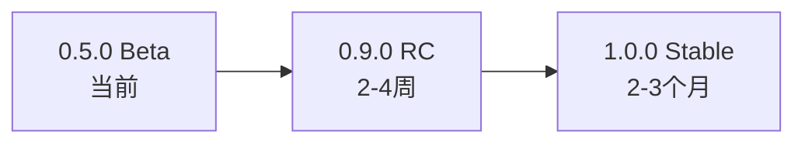

# 版本管理策略

## 📋 版本概述

Unicycle4T 遵循 [Semantic Versioning (SEMVER)](https://semver.org/) 规范，采用分阶段的版本发布策略。

## 🎯 当前版本

**版本**: `0.5.0`
**状态**: Beta (开发版本)
**说明**: 核心功能完整，API仍在演进中

## 📈 版本路线图

### 版本阶段说明

| 阶段 | 版本范围 | 状态 | 预期时间 | 发布标准 |
|-----|---------|------|---------|---------|
| **Beta** | `0.5.x` | 开发测试 | 当前 | 核心功能完整，测试覆盖率 > 95% |
| **RC** | `0.9.x` | 发布候选 | 2-4周 | API稳定，功能完善，生产验证 |
| **Stable** | `1.x.x` | 生产就绪 | 2-3个月 | 向后兼容，企业级特性 |

## 🔄 版本号规则

### 版本格式：`MAJOR.MINOR.PATCH`

- **MAJOR** (`0` → `1`): 不兼容的API修改
- **MINOR** (`0.5` → `0.6`): 向后兼容的功能新增
- **PATCH** (`0.5.0` → `0.5.1`): 向后兼容的问题修正

### 版本阶段含义

#### `0.x.x` (开发版本)
- ✅ API可能发生变化
- ✅ 新功能积极开发
- ⚠️ 不建议生产环境使用
- 🔄 欢迎反馈和贡献

#### `1.x.x` (稳定版本)
- ✅ API稳定，承诺向后兼容
- ✅ 生产环境就绪
- 🔒 严格遵循SEMVER规范
- 📈 企业级支持

## 📋 发布检查清单

### `0.x.x` 版本发布

- [ ] 所有测试通过 (覆盖率 > 95%)
- [ ] 基础文档更新
- [ ] CHANGELOG.md 记录变更
- [ ] 示例项目可正常运行
- [ ] 基础功能验证通过

### `1.0.0` 正式发布

- [ ] **API稳定性**: 承诺向后兼容
- [ ] **文档完整性**: 所有API有完整文档
- [ ] **生产验证**: 至少1个生产环境使用案例
- [ ] **性能基准**: 性能测试通过
- [ ] **安全审查**: 基础安全检查完成
- [ ] **CHANGELOG**: 完整的版本变更记录
- [ ] **用户反馈**: Beta版本用户积极反馈

## 📊 版本历史

### v0.5.0 (当前) - Beta版本
- 🎉 **发布日期**: 2025-11-14
- ✨ **新特性**: 完整的生命周期管理框架
- 📚 **文档**: 完整README + 5个示例项目
- 🧪 **测试**: 98.21% 代码覆盖率
- 🔧 **配置**: 完善的package.json配置

### 计划中的版本

暂无

## 🚀 升级指南

暂无

## 🔧 开发者指南

### 版本发布流程
1. **功能开发** → 创建feature分支
2. **测试验证** → 单元测试 + 集成测试
3. **文档更新** → API文档 + 示例更新
4. **CHANGELOG** → 记录所有变更
5. **版本标记** → Git tag + 发布说明

### 自动化工具
- **推荐**: `semantic-release` 自动版本管理
- **备选**: 手动版本标记 + GitHub Actions
- **检查**: 预发布自动化测试

## 📞 反馈和支持

### 版本相关问题
- **Bug报告**: [GitHub Issues](https://github.com/linden/unicycle4t/issues)
- **功能建议**: [GitHub Discussions](https://github.com/linden/unicycle4t/discussions)
- **安全问题**: xxxxxx

### 版本通知
- **发布通知**: 关注GitHub Releases
- **更新订阅**: Watch GitHub Repository
- **社区讨论**: GitHub Discussions

---

**注意**: 本版本策略可能根据项目发展需要进行调整，重大变更会提前在GitHub上公示。
